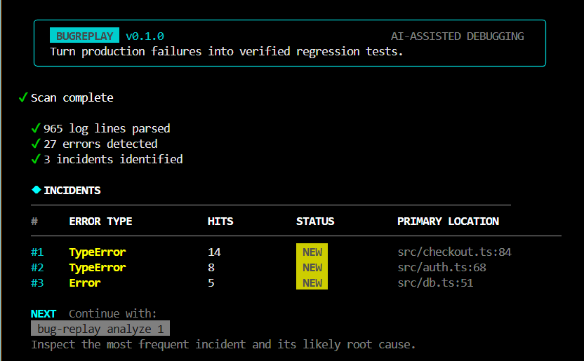
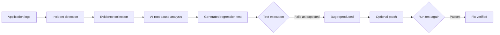

# BugReplay

> Turn production failures into verified regression tests.

BugReplay is an experimental AI-assisted debugging CLI. It groups related errors from application logs, collects relevant source and Git evidence, proposes a root cause, generates a Vitest regression test, and verifies the result by actually running that test.

The core principle is simple: **AI proposes; evidence supports; tests verify.**

## Terminal Preview



## What it does

- Parses application logs and extracts stack traces
- Groups repeated errors into trackable incidents
- Connects failures to nearby source code and Git history
- Separates facts, hypotheses, and assumptions
- Generates reproduction plans and Vitest regression tests
- Proposes source patches with a reviewable terminal diff
- Runs real tests before calling a bug reproduced or resolved
- Stores project state locally in `.bugreplay/`

## Workflow



## Requirements

- Node.js 18 or newer
- npm
- Git (recommended for evidence collection)
- A [Gemini API key](https://aistudio.google.com/app/apikey) for `analyze`, `reproduce`, and `fix`

`scan`, `incidents`, `verify`, `report`, and `config` do not directly call the AI provider. Gemini is currently the only implemented AI provider; OpenAI and Anthropic support is planned.

## Installation

Clone the repository, replacing `YOUR_USERNAME` with the repository owner:

```bash
git clone https://github.com/YOUR_USERNAME/bug-replay.git
cd bug-replay
npm install
npm run build
npm link
```

`npm link` makes the `bug-replay` command available globally on your machine. During development, you can instead use `npm run dev -- <command>` from the repository root.

## Configuration

Copy the safe example file to `.env`.

macOS or Linux:

```bash
cp .env.example .env
```

Windows PowerShell:

```powershell
Copy-Item .env.example .env
```

Then add your own Gemini key:

```env
BUGREPLAY_API_KEY=your_gemini_api_key
BUGREPLAY_AI_PROVIDER=gemini
BUGREPLAY_MODEL=gemini-flash-latest
BUGREPLAY_LOG_LEVEL=info
BUGREPLAY_CONTEXT_LINES=30
```

Never commit `.env`. The included `.gitignore` excludes local environment files while allowing the placeholder-only `.env.example` to be shared.

Confirm the active configuration without displaying the full key:

```bash
bug-replay config
```

## Quick-start demo

BugReplay includes a demo project with sample logs and intentional failures.

```bash
cd demo

# Detect and group errors
bug-replay scan logs/server.log
bug-replay incidents

# Investigate incident 1
bug-replay analyze 1
bug-replay reproduce 1

# The generated regression test should initially fail, proving the bug
bug-replay verify 1

# Review a proposed patch and choose whether to apply it
bug-replay fix 1

# Run the same regression test after the patch
bug-replay verify 1

# Export a Markdown incident report
bug-replay report 1
```

If you skipped `npm link`, run commands from the repository root like this:

```bash
npm run dev -- scan demo/logs/server.log
npm run dev -- incidents
npm run dev -- analyze 1
```

Run `bug-replay` with no arguments for quick-start help, or `bug-replay <command> --help` for command-specific options.

## Commands

| Command | Purpose | AI key required |
|---|---|:---:|
| `bug-replay scan <logfile>` | Parse logs and group related errors | No |
| `bug-replay incidents` | List incidents, status, frequency, and location | No |
| `bug-replay analyze <id>` | Collect evidence and propose a root cause | Yes |
| `bug-replay reproduce <id>` | Generate a reproduction plan and Vitest test | Yes |
| `bug-replay fix <id>` | Generate a patch proposal and request approval | Yes |
| `bug-replay verify <id>` | Execute the generated regression test | No |
| `bug-replay report <id>` | Export a Markdown incident report | No |
| `bug-replay config` | Show the active configuration | No |

Useful options:

```bash
bug-replay analyze 1 --force       # Ignore cached analysis
bug-replay reproduce 1 --force     # Overwrite an existing generated test
bug-replay fix 1 --apply           # Apply the proposal without the y/N prompt
```

## Generated files

BugReplay keeps its working state inside the analyzed project:

```text
.bugreplay/
  state.json                  Incident and analysis state
  report-incident-001.md      Generated incident report

tests/bugreplay/
  incident-001.test.ts        Generated regression test
```

Before changing a source file, BugReplay creates a sibling backup ending in `.bugreplay.orig`. Local state, backups, logs, and `.env` files are ignored by Git by default.

## Security and privacy

BugReplay reads local logs and source code to build debugging evidence. For AI-powered commands, selected log messages, source snippets, incident data, and prompts are sent to the configured Gemini endpoint.

Protections currently implemented:

1. **Secret redaction:** common API keys, passwords, JWTs, connection strings, and private keys are redacted before prompts are sent.
2. **Limited source context:** only relevant snippets are collected, with a configurable context limit.
3. **Command allowlist:** automatic execution is restricted to `npm test`, `npm run test`, `npm install`, and supported `npx vitest run` forms.
4. **Opt-in source changes:** `fix` asks for confirmation unless `--apply` is explicitly supplied.
5. **Patch containment:** patch targets must be existing files inside the project root.
6. **Local state:** incident data is written to the project's `.bugreplay/` directory.

Automated redaction reduces risk but cannot guarantee that every possible secret or sensitive value will be detected. Review logs and source material before using AI-powered commands on confidential projects.

## Development

```bash
npm install
npm run lint
npm test
npm run build
```

For watch mode:

```bash
npm run test:watch
```

The test suite includes parser, grouping, schema, security, patch-containment, terminal UI, and end-to-end workflow coverage.

## Architecture

```text
src/
|-- cli/            Commands and terminal UI
|-- core/           Parsing, grouping, evidence, reproduction, and patching
|-- ai/             Provider, prompts, and validated response schemas
|-- integrations/   Filesystem, Git, and test-runner adapters
|-- security/       Secret redaction and command policy
|-- storage/        Project-local state persistence
`-- types/          Shared TypeScript contracts
```

## Troubleshooting

### `AI provider is not configured`

Create `.env` in the repository or target project and set `BUGREPLAY_API_KEY`. When running inside `demo/`, BugReplay also checks the parent directory for `.env`.

### PowerShell blocks `npm` or `npx`

Use the Windows command shims:

```powershell
npm.cmd install
npm.cmd run build
npm.cmd run dev -- incidents
```

### `No incidents found`

Scan a log file first:

```bash
bug-replay scan path/to/application.log
```

### A generated test does not run

BugReplay currently generates and executes Vitest tests. Make sure the target project has a compatible Vitest setup and that its dependencies are installed.

### Show diagnostic details

Set `BUGREPLAY_LOG_LEVEL=debug` in `.env`, then rerun the command.

## Current limitations

- Gemini is the only implemented AI provider.
- Generated regression tests currently target Vitest projects.
- Patch application replaces an exact source snippet; changed source may require regenerating the proposal.
- AI analysis can be incorrect. Treat it as a hypothesis until test execution verifies the behavior.

## Contributing

Contributions are welcome. Before opening a pull request:

1. Keep changes focused and avoid committing `.env`, logs, `.bugreplay/`, or generated backups.
2. Add or update tests for behavior changes.
3. Run `npm run lint`, `npm test`, and `npm run build`.
4. Explain the user-facing impact and any security considerations in the pull request.

## License

MIT, as declared in `package.json`.
